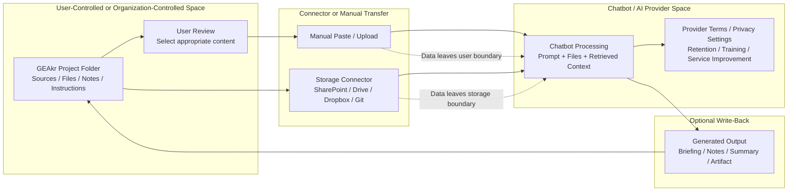

# Privacy Boundary Diagram

## Purpose

Show where information moves when a user applies the GEAkr folder pattern with a chatbot or AI assistant.

GEAkr organizes project context. It does not create a privacy boundary, approve a tool, or change provider terms.

## Diagram message

The privacy boundary depends on:

- storage location
- chatbot or AI provider
- connector permissions
- user settings
- organizational rules
- sensitivity of the information

## Conceptual diagram

## Labels for a slide version

Use these labels on the diagram:

- User-controlled / organization-controlled space
- Manual transfer or connector transfer
- Chatbot / AI provider space
- Provider terms and privacy settings apply here
- Optional write-back requires connector permission
- GEAkr organizes context but does not make content private

## Suggested caption

GEAkr defines the project context. Data movement and privacy depend on the chatbot, connectors, user permissions, provider settings, and applicable organizational guidance.

## Video narration

"GEAkr helps organize project context, but it does not change the privacy boundary. If you paste, upload, or connect files to a chatbot, that content may be processed by the chatbot provider under its terms and settings. Before using project material, check the applicable guidance, provider settings, and whether the information is appropriate for the selected tool."
