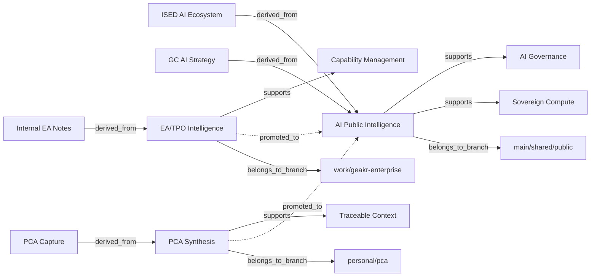

# Knowledge Graph Overlay Across Branches

Date: 2026-04-25
Status: v0.1 concept

## Purpose

Provide a graph overlay across GEAkr knowledge nodes without collapsing branch boundaries.

The graph helps show how public, work, and personal/PCA knowledge relate, while preserving controls around privacy, classification, and promotion.

---

## Core idea

Branches remain separate. The graph is an overlay.

```text
main/shared/public  ─┐
work/geakr-enterprise ├─> graph overlay
personal/pca        ─┘
```

The graph does not mean all content is merged. It means relationships are indexed and visualized.

---

## Node types

### Source
A registered URL, document, policy, strategy, or internal reference.

### Knowledge
An extracted knowledge file derived from a source.

### Response
A PCA or skill-generated response artifact.

### Concept
A reusable idea, theme, capability, risk, or architectural principle.

### Skill
A repeatable task pattern, such as strategy alignment or AIA pre-check.

### Branch
A context boundary: `main`, `work/geakr-enterprise`, `personal/pca`.

---

## Edge types

- `derived_from` — knowledge derived from source
- `summarizes` — response summarizes knowledge
- `supports` — knowledge supports concept or claim
- `challenges` — knowledge conflicts with or questions concept
- `promoted_to` — sanitized knowledge promoted to shared branch
- `related_to` — general relationship
- `uses_skill` — response generated using a skill
- `belongs_to_branch` — artifact belongs to branch context

---

## Boundary rule

The graph may show that a relationship exists across branches, but it must not expose protected/internal/personal content into another branch unless promoted.

Allowed public graph view:

- node title
- source layer
- branch
- public-safe tags
- relationship type

Restricted graph view:

- full content
- internal notes
- personal synthesis
- unreviewed response text

---

## Metadata required for graph extraction

Knowledge files should include:

```yaml
source: <url or reference>
source_type: <type>
status: extracted
source_layer: public | internal | personal
origin_branch: main | work/geakr-enterprise | personal/pca
trust_state: provisional | trusted | rejected
reconciliation_status: not_reconciled | reconciled
concepts:
  - ai_governance
  - sovereign_compute
  - capability_management
```

Response files should include:

```yaml
source: <url or knowledge file>
mode: immediate_response | skill_response
origin_branch: personal/pca
response_status: synthesized
uses_skill: pca_immediate_response
concepts:
  - ai_strategy
  - enterprise_architecture
```

---

## Mermaid prototype



---

## Views

### Public-safe view
Shows public and promoted concepts only.

### EA/TPO view
Shows public plus work branch concepts and promoted internal-safe insights.

### PCA view
Shows public plus personal/PCA concepts and private synthesis.

### Full local owner view
Shows all nodes and edges for the repository owner only.

---

## Implementation path

### v0.1
Manual Mermaid graph in documentation.

### v0.2
Script scans Markdown metadata and emits `graph/nodes.json` and `graph/edges.json`.

### v0.3
Static HTML graph viewer using Cytoscape.js or D3.

### v0.4
Branch-aware graph filters.

### v0.5
Promotion workflow generates graph diff.

---

## Strategic value

The graph overlay turns GEAkr from a folder pattern into an intelligence map:

- what sources exist
- what knowledge was extracted
- what concepts are emerging
- what was promoted across boundaries
- what remains provisional
- where public, work, and personal/PCA knowledge reinforce each other
