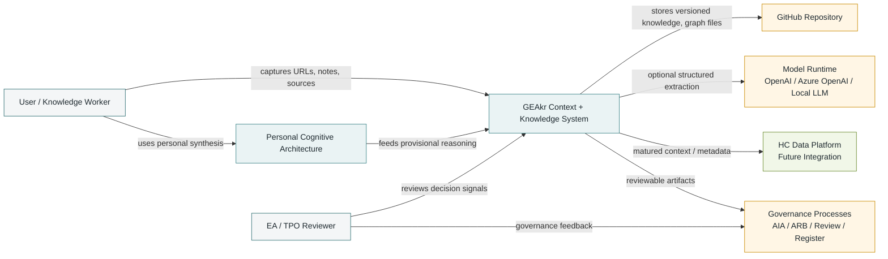
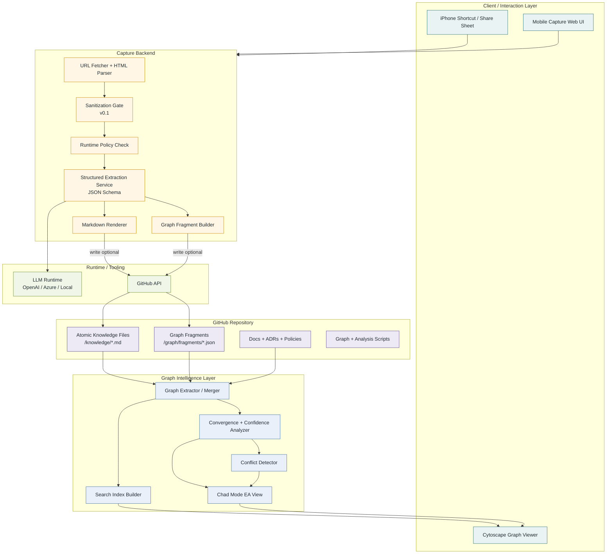
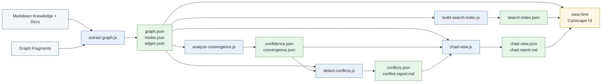
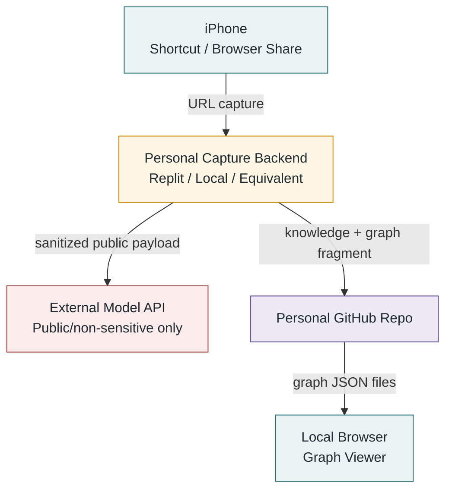
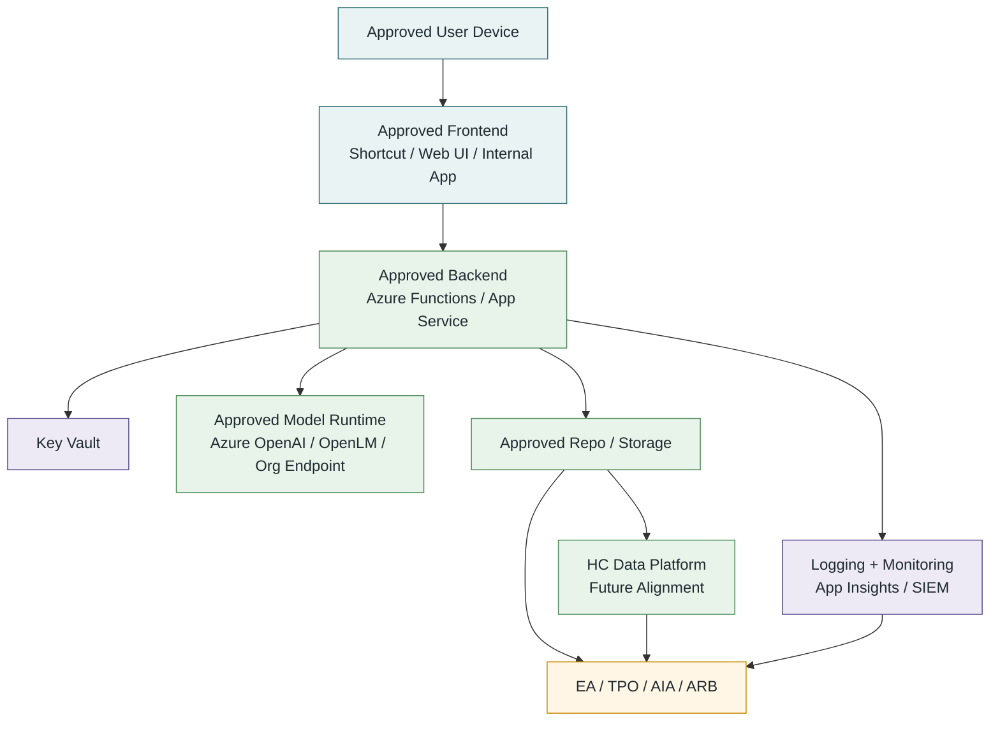

# GEAkr + PCA Architecture — C4 Model

Date: 2026-04-25
Status: v0.1 C4 architecture draft
Scope: GEAkr / PCA / Graph Intelligence / Enterprise alignment

## Purpose

This document describes the GEAkr + PCA system using a C4-style architecture model:

1. System Context
2. Container View
3. Component View
4. Deployment View

The goal is to complement the DTB-style layered architecture diagram with a more software-architecture-oriented view.

---

## C4 Level 1 — System Context

### Context notes

- GEAkr is the central context and knowledge-preparation system.
- PCA is a personal reasoning layer that may feed provisional synthesis into GEAkr.
- GitHub provides version control, branching, PRs, traceability, and future CI/CD.
- LLM runtime is optional and depends on runtime/data-sharing policy.
- HC Data Platform integration is a future maturity path, not a current dependency.

---

## C4 Level 2 — Container View

### Container notes

- The mobile capture backend is the only part that needs server-side hosting for URL fetch, LLM calls, and GitHub write-back.
- The graph viewer is static and can run locally or from GitHub Pages.
- The graph intelligence layer can run locally first, then later through GitHub Actions.
- Work use requires approved runtime and approved hosting.

---

## C4 Level 3 — Component View: Capture Backend

```mermaid
flowchart LR

  API[POST /extract]
  Validate[Request Validator]
  Fetch[URL Fetcher]
  Parse[HTML Parser\nCheerio]
  Sanitize[Sanitizer\nRegex Risk Gate]
  Policy[Runtime Policy Gate\nplanned]
  Schema[JSON Schema Extractor]
  LLM[LLM SDK Client]
  Render[Knowledge Markdown Renderer]
  Graph[Graph Fragment Builder]
  GitHub[GitHub Writer]
  Response[API Response]

  API --> Validate
  Validate --> Fetch
  Fetch --> Parse
  Parse --> Sanitize
  Sanitize --> Policy
  Policy --> Schema
  Schema --> LLM
  LLM --> Render
  LLM --> Graph
  Render --> GitHub
  Graph --> GitHub
  Render --> Response
  Graph --> Response

  classDef api fill:#EAF3F4,stroke:#2F6F73,color:#1F2A30;
  classDef safety fill:#FFF6E5,stroke:#C98A00,color:#1F2A30;
  classDef ai fill:#E8F4EA,stroke:#4B8B57,color:#1F2A30;
  classDef store fill:#EDEAF6,stroke:#5B4A8B,color:#1F2A30;

  class API,Validate,Fetch,Parse api;
  class Sanitize,Policy safety;
  class Schema,LLM,Render,Graph ai;
  class GitHub,Response store;
```

### Component notes

Current implemented components:

- URL fetcher
- Cheerio-based text extraction
- sanitization gate
- OpenAI SDK model call
- JSON-schema structured output
- deterministic Markdown renderer
- graph fragment builder
- optional GitHub write-back

Planned component:

- full runtime policy gate by branch/runtime mode

---

## C4 Level 3 — Component View: Graph Intelligence

### Graph notes

The graph layer supports:

- node/edge extraction
- searchable graph interface
- concept convergence
- confidence scoring
- conflict detection
- Chad Mode EA decision filtering

---

## C4 Level 4 — Deployment View: Personal Prototype

### Personal deployment notes

- Replit or equivalent is acceptable only for personal experimentation with public or non-sensitive sources.
- External API calls send payloads to the configured provider endpoint.
- Sanitization reduces risk but is not a security boundary.

---

## C4 Level 4 — Deployment View: Work / Enterprise Target

### Enterprise deployment notes

- Replit or equivalent should not be used for work material unless explicitly approved.
- Work use requires approved hosting, approved model runtime, approved storage, identity, secrets management, logging, and governance alignment.
- GEAkr remains a context pattern; the deployment environment determines whether a specific use is acceptable.

---

## Key architectural decisions reflected in C4 model

1. GEAkr is a context pattern, not a platform.
2. Capture backend is optional and environment-specific.
3. Model runtime is optional and policy-dependent.
4. Sanitization happens before model calls but is not a security boundary.
5. Structured output makes knowledge files deterministic and graphable.
6. GitHub provides version/control, not privacy assurance by itself.
7. Public, work, and personal/PCA knowledge remain logically separated.
8. Graph intelligence is an overlay, not a permission model.
9. Work use requires approved enterprise runtime and storage.
10. HC Data Platform integration is a maturity path for governed use cases.

---

## One-line C4 summary

GEAkr captures and structures project context into versioned knowledge and graph intelligence, while separating personal, public, and work boundaries and allowing deployment to range from personal prototype to approved enterprise runtime.
